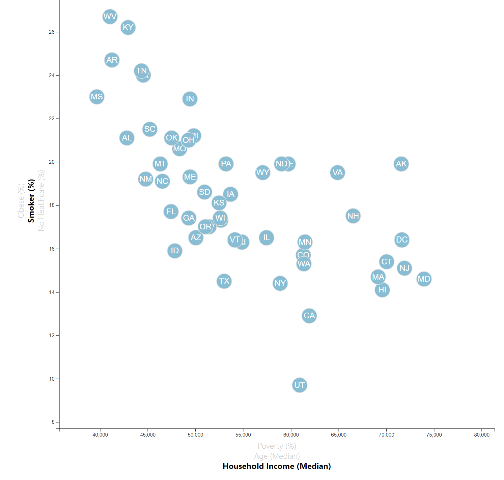

# Health Variables

Interactive scatter plot between health variables by each United States (US) state. Variables include the absence of healthcare, smoker status, obesity, poverty, median age, and median household income. States are represented with abbreviated circle elements. Tooltips display data that the user has selected. Click events allow the user to decide which data to display.

## Health Scatter Plot

## Data Source

Data from the [US Census Bureau](https://data.census.gov/cedsci/), and the Behavioral Risk Factor Surveillance System based on 2014 ACS 1-year estimates.

## Authors

- **David W. Mueller**
  - [LinkedIn Profile](https://www.linkedin.com/in/davidwaltermueller/)
  - davemuelle@gmail.com

## Acknowledgments

- Michigan State University Data Analytics Bootcamp; July 14, 2021.
